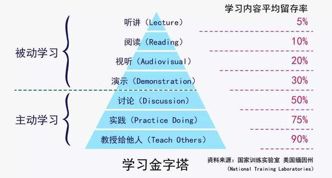

# 前言：驽马十驾

>  为学日益，为道日损

本博客建立于2022年1月22日，用于记录一个普通技术人为了一点小小愿望而奋斗的过程。

从2022年开始，所有的读书笔记和学习的文档笔记都会在这个地方进行分享。

> 风带来故事的种子，时间使之发芽。风带来新的故事，时间使之成为神话

对待学问的态度，归根到底是一个“诚”字。学习最重要的就是对自己诚实。

知之为知之，不知为不知，是知也。坦诚自己的无知是学习的第一步。

默而识之，学而不厌，诲人不倦。

# 知识与你分享

## 目录树

> 不积跬步，无以至千里。
>
> 需要一个“完全包含”的分类集。

- 技术和专业类（T）
  - 理论类
  - 计算机类
    - 计算机通识
    - 编程语言
    - Linux嵌入式
  - 电子信息类
    - 人工智能
    - 机器人技术
    - 通识
- 文学和哲学（A）
  - 文学
  - 哲学

- 经济和社会（S）
  - 工作方法论
  - 工程管理
  - 常识

## 阅读书单

> 知其雄，守其雌，为天下溪

| 书名                                                         | 分类            |
| ------------------------------------------------------------ | --------------- |
| [数据结构和算法](books\技术和专业类\计算机\计算机通识\数据结构与算法.md) | T-计算机-通识 |
| [GIT手册](books\技术和专业类\计算机\计算机通识\git.md) | T-计算机-通识 |
| [**计算机导论**](books\技术和专业类\计算机\计算机通识\计算机导论.md) | T-计算机-通识 |
| [操作系统](books\技术和专业类\计算机\计算机通识\操作系统.md) | T-计算机-通识 |
| [深入理解计算机系统](books\技术和专业类\计算机\计算机通识\CSAPP.md) | T-计算机-通识 |
| [编程珠玑](books\技术和专业类\计算机\计算机通识\编程珠玑.md) | T-计算机-通识 |
| [人工智能](books\技术和专业类\电子信息\人工智能\AI.md) | T-电子信息-AI |
| [嵌入式C语言自我修养](books\技术和专业类\计算机\编程语言\嵌入式C.md) | T-计算机-编程 |
| [C和指针](技术和专业类\计算机\编程语言\PointersOnC.md) | T-计算机-编程 |
| [C++入门](books\技术和专业类\计算机\编程语言\C++入门笔记.md) | T-计算机-编程 |
| [C++ Primer（第五版）](books\技术和专业类\计算机\编程语言\C++Primer.md) | T-计算机-编程 |
| [**C++工程问题求解**](books\技术和专业类\计算机\编程语言\C++工程问题求解.md) | T-计算机-编程 |
| [Docker](books\技术和专业类\计算机\Linux\Docker.md) | T- 计算机-Linux |
| [云原生](books\技术和专业类\计算机\Linux\云原生（阿里云）.md) | T- 计算机-Linux |
| [SICP](books\技术和专业类\计算机\编程语言\SICP-计算机程序的构造和解释.md) | T- 计算机-编程语言 |
| [**C编程语言**](books\技术和专业类\计算机\编程语言\C语言程序设计.md) | T- 计算机-编程语言 |
| [数字图像处理技术](books\技术和专业类\电子信息\通识\数字图像处理.md) | T-电子信息-通识 |
| [PetriNets基础](books\技术和专业类\理论\PetriNets.md) | T-理论 |
| [常用的Linux工具](books\技术和专业类\计算机\Linux\资源.md) | T-计算机-Linux |
| [鸟哥的Linux私房菜-基础篇](books\技术和专业类\计算机\Linux\鸟哥的Linux私房菜-基础篇.md) | T-计算机-Linux |
| [**从树莓派开始学习Linux**](books\技术和专业类\计算机\Linux\从树莓派开始玩转Linux.md) | T-计算机-Linux |
| [物联网](books\技术和专业类\电子信息\其它\物联网IoT.md) | T-电子信息-通识 |
| [机器人技术](books\技术和专业类\电子信息\机器人和硬件\机器人技术.md) | T-电子信息-硬件 |
| [机械电子学](books\技术和专业类\电子信息\机器人和硬件\机械电子学.md) | T-电子信息-硬件 |
| [**科技英语写作**](books\技术和专业类\理论\科技英语写作.md) | T-理论 |
| [**现代控制理论**](books\技术和专业类\理论\现代控制理论.md) | T-电子信息-硬件 |
| [**运动控制**](books\硬件\运动控制.md)     | T-理论 |
| [**PetriNets基础**](books\硬件\PetriNets)    | T-理论 |
| [建模技术](books\技术和专业类\电子信息\机器人和硬件\建模技术.md) | T-电子信息-硬件 |
| [**硬件实战类书籍**](books\技术和专业类\电子信息\机器人和硬件\硬件实战类.md) | T-电子信息-硬件 |
| [OpenCV4快速入门](books\技术和专业类\电子信息\人工智能\计算机视觉.md) | T-电子信息-AI   |
| **[图解人工智能](books\技术和专业类\电子信息\人工智能\图解人工智能.md)** | T-电子信息-AI   |
| [计算机视觉](books\技术和专业类\电子信息\人工智能\计算机视觉.md) | T-电子信息-AI   |
| [机器学习-吴恩达](books\技术和专业类\电子信息\人工智能\吴恩达机器学习.md) | T-电子信息-AI   |
| [版权和专利](books\技术和专业类\理论\专利和版权.md)          | T-理论          |
| [**增长黑客**](books\方法论\增长黑客.md)                 | S-常识 |
| [**硬件产品设计与开发**](books\方法论\硬件产品设计与开发.md) | S-工程管理 |
| [**延迟满足**](books\经济和社会\方法论\延迟满足.md) | S-方法论 |
| [**从断舍离到极简主义**](books\经济和社会\方法论\从断舍离到极简主义.md) | S-方法论 |
| [**单核工作法**](books\经济和社会\方法论\单核工作法.md) | S-方法论 |
| [**重构：年轻人的精进之道**](books\经济和社会\方法论\重构.md) | S-方法论 |
| [**IT项目管理**](books\经济和社会\工程管理\IT项目管理.md)    | S-工程管理      |
| [系统工程](books\经济和社会\工程管理\系统工程.md)            | S-工程管理      |
| **[增长黑客](books\经济和社会\工程管理\增长黑客.md)**        | S-工程管理      |
| [极简项目管理](books\经济和社会\工程管理\极简项目管理.md)    | S-工程管理      |
| [老舍](books\文学和哲学\老舍.md)      | A-文学 |
| [阿城](books\文学和哲学\阿城.md) | A-文学 |
| **[蝇王](books\文学和哲学\蝇王.md)** | A-文学 |
| [**生死疲劳-莫言**](books\文学和哲学\生死疲劳.md) | A-文学 |
| **第七天-余华**                                  | A-文学 |
| [**一课经济学**](books\经济和社会\常识\一课经济学.md) | S-常识  |
| **[贫穷的本质](books\经济和社会\常识\贫穷的本质.md)** | S-常识  |
| **[黑天鹅](books\经济和社会\常识\黑天鹅.md)** | S-常识  |
| [**行为经济学**](books\经济和社会\常识\行为经济学.md) | S-常识  |
| [社会学](books\经济和社会\常识\社会学.md) | S-常识 |

## [实验和竞赛笔记](ExpRecords\书单.md)

- [NJU-PA1](ExpRecords\NJU_PA1.md)
- [CS61A SICP-Lab](ExpRecords\NJU_PA1.md)
- [23华为嵌入式软件精英赛](ExpRecords\Competition01.md)

## [规划和记录](Learning-Record\路径.md)

- [2023年](Learning-Record\2023.md)

