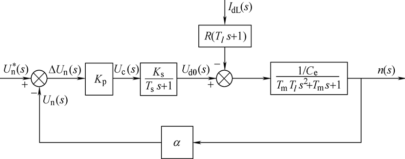

# 运动控制（课程）

## Chapter 1 一些常识和课程概论

1. 电的使用和发展可以分为三个阶段：
   1. **直流输电阶段 ：**发电、输电和用电均为直流电

      主张采用直流输电 ：爱迪生、开尔文

      1882年，在德国建成57km向慕尼黑国际展览会送电的是直流输电线路。

   2. 交流输电阶段 ：发电、输电和用电均为交流电

      随着三相交流发电机，感应电动机和变压器的迅速发展。同时变压器又可方便地改变交流电压，从而使交流输电和交流电网得到迅速的发展，并很快占据了统治地位。1888年，由费朗蒂设计的伦敦泰晤士河畔的大型交流电站开始输电。

   3. **交直流输电并存阶段** ：发电站发电和用户用电仍然是交流电，只是在远距离输电中，采用换流设备，把交流高压变成直流高压。

2. 频率为什么是50Hz/60Hz？

   1. 高于50Hz：损耗增大，同时发电机转速过快，系统不容易保持稳定安全；
   2. 低于50Hz：电弧可能会伴随出现（直流中的电器插拔容易出现电火花）

3. 本课程重点：电动机/发电机——电能和机械能转换的设备。

4. 控制的不同分类：过程控制、运动控制，两者有何不同？——被控对象、控制目标不同

5. 运动控制：电机为控制对象，控制器为核心，功率变换装置为执行机构；

   1. 硬件构成：控制器、执行器、被控对象（电机+负载）

   2. 电机：直流、交流电机

   3. 功率变换部分：可控整流、直流斩波、逆变；

   4. 控制器部分：PID控制……等等控制策略

   5. 分类：

      • 按电机分：直流系统，交流系统；

      • 按被控量分：调速系统，位置随动系统，转矩控制系统；

      • 按控制器的类型分：模拟型，数字型；

      • 按控制原理分：PID控制，模糊控制，矢量控制等等；

      • 按闭环数分：单环，双环，多环系统

      • 可交叉：如数字式双闭环直流调速系统

   6. 特点：

      •传动功率范围大，几毫瓦到几百兆瓦；

      •调速范围宽，1：10000，每小时几转到每分钟几十万转；过渡过程快，秒级或毫秒级；

      •具有较高的动、静态性能；

      •四相限运行，能量回馈，多机协调；

      •合理地选择系统方案几乎可以适用任何电气传动场合的要求;

6. 课程目的：解决工程实际问题为目的——为了控制相关物理量，学习建模、分析与实现相关的技术

   1. 直流交流电机原理
   2. 电机的变换效率、外特性
   3. 电机数学模型的建立

## Chapter 2 电机部分

1. 典型生产机械的运动形式：单轴旋转系统、多轴旋转、多轴旋转运动+平移运动、多轴旋转运动+升降运动

2. 运动方程：

   1. J是转动惯量，Ω是角速度，n是转速(r/min为单位)，G是圆盘质量，D是圆盘直径。
   2. 375=4g*60(60来源于转速n到Ω的单位转换)
   3. 电机产生的电磁转矩Te-拖动负载转矩TL=转动惯量*角加速度

   $$
   T_e-T_L=J*\frac{d\Omega}{dt}=J\frac{d^2\theta}{dt}
   =\frac{GD^2}{375}\frac{dn}{dt}\\
   T=C_TΦI_a\qquad直流电机转矩公式\\
   U=E+I_aR
   $$

   

## Chapter 3 电能变换

* 归结就是：整流、逆变、崭波和周波变换四种

  直流电机驱动：一般DC-DC

  感应电机交流驱动:SPWM或者DC-AC

  永磁同步电机交流驱动：PWM的DC-DC、DC-AC

1. 直流电动机的需求：需要励磁的直流和通过电动机的直流，有时候只需要一个直流源（并励、串励、复励），有时候需要两个直流源（他励）

   1. 其中直流源直接获取或者AC-DC（整流）变换得到
   2. 整流的方式包括
      1. 二极管整流（单相、三相不可控）
      2. 全控整流（二极管改为晶闸管）：换相过程中，另外一对晶闸管承受反压关断；PWM桥式整流能够完成能量回馈
   3. DC-DC：六种基本的斩波形式
      1. 桥式可逆斩波电路：是将两个斩波电路合并，控制四个两对开关元器件的通断可以

2. 交流电动机的需求：

   1. 三相异步——原理是通过三相交流电让磁场转动；转子的电流有功分量和无功分量。定子上的交流电产生旋转磁场，带动转子异步转动——因为不同步，才存在无功分量。

   2. 转速公式（稳态运行）：   
   $$
   n_0是旋转磁场转速；s是转差率；\\
   由此可见,掌握交流电的频率f_1和极对数p就可以知道转子的稳态转速了\\
   𝒏=(𝟏−𝒔) 𝒏_𝟎=(𝟏−𝒔) \frac{(𝟔𝟎𝒇_𝟏)}{p}
   $$
   
   磁场转动的速度（即同步转速）完全被交流电的频率和极对数所决定。
   
   3. VVVF是交流电动机调速的电能变化方法：
      1. 单相的情况和之前那个桥式可逆斩波电路一样，在斩波上加入了控制，使得能够控制电流的方向和大小。于是就有了用控制高频PWM的方法制作“正弦”的思路，实现逆变。即SPWM方法。
      2. 三相就是在之前方法上拓展为三路；
      3. 多平的思路就是先分出不同级别的电平，再加上SPWM的控制。
      4. 还有交交逆变的思路，把高平的三相控制开关元器件变成低频交流。

## Chapter 4 PWM控制技术

**PWM** **(Pulse Width Modulation)**控制就是**脉宽调制技术**：即通过对一系列脉冲的宽度进行调制，来等效的获得所需要的波形（含形状和幅值)。

* **冲量（窄脉宽的面积）**相等而形状不同的窄脉冲加在具有惯性的环节（那些不会突变的电路元件——电压：电容、电流：电感）上时，其**效果（输出响应的波形）基本相同**。
* 于是就有了用等幅度不等宽的脉冲来代替一个正弦半波的技术——也可以用不等幅的输入，需要一些计算/单极性、双极性
* 可以模拟出各种波形

生成技术

1. 计算法：提前计算每个占空比，进行调控
2. 调制法：用一个信号波+高频载波的方法，进行比较，然后可以生成PWM波
   1. 上述方法在双极性上也可以使用，拓展到三相同样可行
3. 滞环比较法：把指令电流和实际输出作比较，通过置换控制器作比较实现控制

先进方法：空间矢量脉宽调制SVPWM生成技术

1. 把逆变器和交流电动机视为一体，以圆形旋转磁场为目标来控制逆变器的工作，这种控制方法称作“磁链跟踪控制”，磁链轨迹的控制是通过交替使用不同的电压空间矢量实现的，所以又称“电压空间矢量PWM（SVPWM，Space Vector PWM）控制”。

   1. 简单来说，不再以生成一个正弦为目标，而是直接以生成一个原型旋转磁场为目标

   2. 其手段则是是利用不同的电压空间矢量合成

   3. 不同的电压空间矢量从三相+电路开关=8个空间状态，其中6个有效工作矢量（合成大小一样，有区别的是矢量的方向，一共六个方向，各差60°）顺时针方向走一圈的矢量合成，每个分量都是Us/2。
      $$
      合成出的大小为：\sqrt{\frac{2}{3}}\frac{U_s}{2}
      $$
      

   4. 然后用这六个方向的矢量中取两个接近的进行合成，就获得了任何想要的us

2. 六个有效的工作矢量旋转一周完成一个周期，同时只会有一种电压矢量。
   输出的基波角频率：
   $$
   w_1=\frac{\pi}{3t}
   $$
   磁链近似电压矢量的积分，磁链矢量是一个封闭的正六边形，大小与电压正比，同电源角频率反比。保持磁链的不变，需要
   $$
   \frac{U_d}{w_1}=常数
   $$
   
3. 

3. 期望获得的矢量，则通过两个有效工作矢量进行平行四边形合成，可以获得对应的期望输出——两个us的大小通过关断时间进行控制，最大的幅值
   $$
   u_{smax}=\frac{U_d}{\sqrt2}
   $$

4. 磁链定子控制：把60°的区域进行再次分割为N块，七步完成定子磁链轨迹——N越大，轨迹越接近圆。

SVPWM的特点：

* 8个基本输出矢量，6个有效工作矢量和2个零矢量，在一个旋转周期内，每个有效工作矢量只作用1次的方式，生成正6边形的旋转磁链，谐波分量大，导致转矩脉动。
* 用相邻的2个有效工作矢量，合成任意的期望输出电压矢量，使磁链轨迹接近于圆。开关周期越小，旋转磁场越接近于圆，但功率器件的开关频率将提高。
* 用电压空间矢量直接生成三相PWM波，计算简便。
* 与一般的SPWM相比较，SVPWM控制方式的输出电压最多可提高15%。

## Chapter 5  传感器

1. 电流检测

   1. 检测电阻（一个很小的电阻，测量两头电压）+运放（放大电压进行测量）：成本低、精度高、体积小；温漂大，易受扰动
      1. 高端电流检测：检测的电流靠近电源一侧，共模电压高，但没有地电平干扰
      2. 低端电流检测：检测电流的位置靠近地一侧，共模电压低，但是受到地电平干扰（电流越大干扰越强）
   2. 电流互感器CT/电压互感器PT（变压器原理）
   3. 霍尔电流传感器
   4. Allegro电流传感

2. 电压检测

   1. 交流：电压互感器转为低的直流电压，送入分压后用数据采集系统+A/D转换器进行转换；

      直流：分压+A/D

   2. 电压互感器

   3. 霍尔电压传感器

   4. 光纤电压传感器

3. 温度检测

   1. 接触式：热平衡原理
      1. 热电式传感器：温度转为电信号——金属导体、半导体
      2. 热电偶：温度转化为电势大小
   2. 非接触式：热辐射原理

4. 转速检测

   1. 测速发电机测速

      测速发电机是输出电动势与转速成比例的微特电机。测速发电机的绕组和磁路经精确设计，其输出电动势*E*和转速*n*成线性关系，即*E*=*K\*n*，*K*是常数；

      测速发电机的工作原理是将转速转变为电压信号，它运行可靠，但体积大，精度低，且由于测量值是模拟量，必须经过A/D转换后读入计算机。

      分为：直流和交流测速发电机

   2. 光电编码器测速/测转角

      精度高、体积小，但是需要编程处理

      通过光栅获得脉冲的方式记录转速。

      光栅越密集，分辨率越高；测速误差率表示和实际转速的测速误差率。

      * M测速法的计算公式：（再Tc时间内测得M1的脉冲数量，Z是旋转编码器每转输出的脉冲个数）

      $$
      n=\frac{60M_1}{ZT_c}( r/min)\\
      \delta_{max}=\frac{1}{M_1}*100\%
      $$

      * T测速法的计算公式：

        适合用在低转速的场合

      $$
      n=\frac{60}{ZT_t}=\frac{60f_0}{ZM_2}( r/min)
      $$

      * M/T法测速

        核心思路就是和技术同步开始和关闭，采样的时钟Tc使用系统的定时器来产生，有了这样一个“标准”。M1是编码器的脉冲，M2是时钟的脉冲，f0是时钟的频率。
        $$
        n=\frac{60M_1f_0}{ZM_2}( r/min)
        $$

5. 编码器+丝杠末端=位置反馈

6. 转子位置检测：

   1. 永磁同步电机
   2. 直流无刷电机
   3. 霍尔传感器

## Chapter 6 直流电机控制

1. 要求：

   调速、稳速、加减速

   * 调速范围D(电机在额定负载下的最高转速和最低转速)、静差率s、硬度（电动机外特性下降的斜率）

   * 静差率越大稳定性越差，硬度和静差率是不同的指标，区别在于理想空载转速不同，即使硬度相同静差率也是理想空载小的大。

   * 额定的转速作为最大转速，用最大静差率计算出来的作为最小，可以得到计算调速范围的公式
     $$
     D=\frac{n_{max}}{n_{min}}\\=n_N/n_{min}\\
     =\frac{n_Ns}{\Delta n_N(1-s)}
     $$

2. 直流电动机控制系统的不同类型：有刷、无刷
   $$
   n=\frac{u_a-I_aR_a}{C_T\Phi}
   $$
   

   由公式可见，想要控制直流电动机，方法是：调节点数供电电压ua，减弱励磁磁通，改变电枢回路电阻。自动控制系统一般用变压的方式进行调速。

3. 单闭环控制的直流调速系统

   被调节量是转速，构成的是转速反馈控制的直流调速系统。稳态和动态调速系统

   

   系统两个输入量——Ud0（控制）和Idl（扰动）

   稳态分析：有静差调速系统

4. 控制算法：

   PI控制综合了比例控制和积分控制两种规律的优点，又克服了各自的缺点。比例部分能迅速响应控制作用，积分部分则最终消除稳态偏差。

## Chapter 7 交流电动机控制

分类：同步电动机、异步电动机

交流异步电动机：转子转速小于同步转速。引入转差率来描述
$$
s=\frac{n_1-n}{n_1}*100\%\\
T=C_T\Phi _mI_2cos\theta_2
$$
由于交流电机本质上为[非线性](https://baike.baidu.com/item/非线性)、多变量、强[耦合](https://baike.baidu.com/item/耦合)、参数[时变](https://baike.baidu.com/item/时变/2732582)、大干扰的复杂对象，它的有效控制一直是国内外研究的热点问题，现已提出了多种控制策略与方法。其中经典线性控制不能克服负载、模型参数的大范围变化及非线性因素的影响，控制性能不高；[矢量控制](https://baike.baidu.com/item/矢量控制)、[直接转矩控制](https://baike.baidu.com/item/直接转矩控制)也存在一些问题：近年来，随着现代控制和智能控制的理论发展，先进控制算法被应用于交流电机控制，并取得一定成果。

1. 异步电动机的调压调速

   同步转速保持不变，降低电压来减小磁通，实现调速。

2. 变压变频调速

   每极磁通量为额定值不变，在电压下降的同时提高频率，同步转速随着频率变化。

3. 三相交流电压型PWM变频电源及控制方法

基于动态模型的异步电动机数学模型：

* 三相变量中只有两相为独立变量，完全可以也应该消去一相。所以，三相绕组可以用相互独立的两相正交对称绕组等效代替，等效的原则是产生的合成磁动势相等。当三相绕组和两相绕组合成的旋转磁动势大小和转速都相等时，即认为两相绕组与三相绕组等效，这就是3/2变换。
* 

* N3/N2 = 根号下2/3时候功率不变；转置后变为23变换

## Chapter 8 交流电机高性能控制

1. 异步电动机按照转子磁链定向的矢量控制系统

   通过坐标变换，在按转子磁链定向同步旋转正交坐标系中，得到等效的直流电动机模型。

   仿照直流电动机的控制方法控制电磁转矩与磁链，然后将转子磁链定向坐标系中的控制量反变换得到三相坐标系的对应量，以实施控制。

   ——简单来说就是等效成单相的直流电机模型然后进行控制。

   * 这时候电流闭环控制策略有：1. 2/3变换+滞环控制策略；2. 用滞留的作PI控制，在进行反变换。

     

1. 按定子磁链控制的直接转矩控制系统

   **直接转矩控制系统简称**DTC(Direct Torque Control)系统，是继矢量控制系统之后发展起来的另一种高动态性能的交流电动机变压变频调速系统。

   在转速环内，利用转矩反馈直接控制电动机的电磁转矩，因而得名。

   直接转矩控制系统的基本思想是根据定子磁链幅值偏差的正负符号和电磁转矩偏差的正负符号，再依据当前定子磁链矢量所在的位置，直接选取合适的电压空间矢量，减小定子磁链幅值的偏差和电磁转矩的偏差，实现电磁转矩与定子磁链的控制。

   与之前的那个矢量合成的思路类似。

